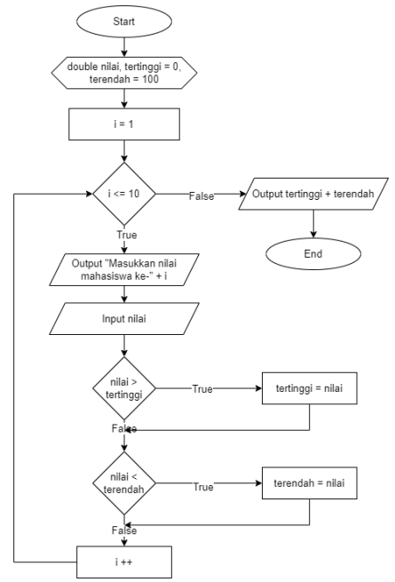
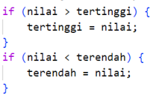
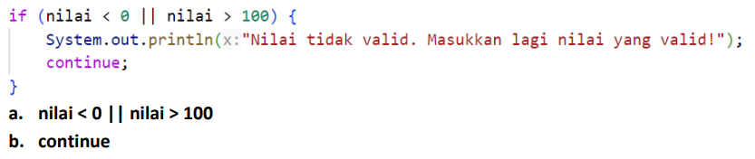

# Percobaan - 1

Di dalam Sistem Informasi Akademik (SIAKAD), dosen mengisi nilai mata kuliah Praktikum
Dasar Pemrograman yang ditempuh oleh mahasiswa. Dosen tersebut ingin mencari nilai
tertinggi dan terendah Kuis dari 10 mahasiswa di dalam satu kelas. Dosen tersebut harus
memasukkan nilai dari setiap siswa, kemudian menentukan dan menampilkan nilai tertinggi
dan terendah. Perhatikan flowchart berikut ini:



---
## Soal

1. Sebutkan dan tunjukkan masing-masing komponen perulangan FOR pada kode program Percobaan 1!
2. Mengapa variabel tertinggi diinisialisasi 0 dan terendah diinisialisasi 100? Apa yang terjadi jika variabel tertinggi diinisialisasi 100 dan terendah diinisialisasi 0?
3. Jelaskan fungsi dan alur kerja dari potongan kode berikut!



4. Modifikasi kode program sehingga terdapat perhitungan untuk menentukan berapa mahasiswa yang lulus dan yang tidak lulus berdasarkan batas kelulusan (nilai minimal 60). Tampilkan jumlah mahasiswa lulus dan tidak lulus setelah menampilkan nilai tertinggi dan terendah!

5. Commit dan push kode program ke Github

---
## Jawaban

1. Komponen for ada tiga, pada kasus ini yaitu inisialisasi, kondisi, increment
    - Inisialisasi: int i = 1 (variabel penghitung dimulai dari 1.)
    - Kondisi: i <= 10 (perulangan akan terus dijalankan selama i kurang dari atau sama dengan 10.)
    - Increment: i++ (setiap selesai satu putaran, nilai i akan bertambah 1.)
2. Nilai tertinggi di awal dianggap 0 agar nilai mahasiswa pertama pasti lebih besar dan menggantikan nilai awal. Nilai terendah di awal dianggap 100 agar nilai mahasiswa pertama pasti lebih kecil dan menggantikan nilai awal.
3. Fungsi dari codenya adalah sebagi berikut:
    - if pertama memeriksa apakah nilai yang diinputkan pengguna lebih besar dari nilai tertinggi sebelumnya. Jika iya maka tertinggi diperbarui dengan nilai tersebut.
    - if kedua kebalikannya yaitu memeriksa apakah nilai yang diinputkan pengguna lebih kecil dari nilai terendah sebelumnya. Jika iya maka terendah diperbarui dengan nilai tersebut.
4. berikut kode yang udah dimodifikasi:
```java
public static void main(String[] args) {
    Scanner sc = new Scanner(System.in);
    double nilai, tertinggi = 0, terendah = 100;
    int mahasiswaLulus = 0; //M
    int mahasiswaTidakLulus = 0; //M
    for (int i = 1; i <= 10; i++) {
        System.out.print("Masukkan nilai mahasiswa ke-" + i + ": ");
        nilai = sc.nextDouble();
        if (nilai > tertinggi) {
            tertinggi = nilai;
        }
        if (nilai < terendah) {
            terendah = nilai;   
        }
        if (nilai >= 60 ) { //M
            mahasiswaLulus++; //M
        }else{ //M
            mahasiswaTidakLulus++; //M
        } //M
    }
    System.out.println("Nilai tertinggi: " + tertinggi);
    System.out.println("Nilai terendah: " + terendah);
    System.out.println("Jumlah mahasiswa yang lulus: " + mahasiswaLulus); //M
    System.out.println("Jumlah mahasiswa yang tidak lulus: " + mahasiswaTidakLulus);//M
    sc.close();
}
```

5. done

---
# Percobaan - 2

Seorang dosen ingin memasukkan nilai beberapa mahasiswa ke dalam SIAKAD untuk
ditentukan kategori nilai hurufnya. Program harus meminta dosen untuk memasukkan nilai
setiap mahasiswa. Jika dosen memasukkan nilai yang tidak valid (negatif atau lebih dari 100),
program harus mengabaikan input tersebut dan meminta dosen untuk melakukan input
ulang. Selanjutnya, nilai yang valid dikelompokkan ke dalam kategori huruf A (80 < nilai ≤ 100),
B+ (73 < nilai ≤ 80), B (65 < nilai ≤ 73), C+ (60 < nilai ≤ 65), C (50 < nilai ≤ 60), D (39 < nilai ≤ 50),
dan E (nilai ≤ 39).
Berdasarkan studi kasus tersebut, buat program menggunakan bahasa pemrograman
Java.

---
## Soal

1. Pada potongan kode berikut, tentukan maksud dan kegunaan dari sintaks berikut:



2. Mengapa sintaks i++ dituliskan di akhir perulangan WHILE? Apa yang terjadi jika posisinya dituliskan di awal perulangan WHILE?
3. Apabila jumlah mahasiswa yang dimasukkan adalah 19, berapa kali perulangan WHILE akan berjalan?
4. Modifikasi kode program sehingga apabila terdapat mahasiswa yang mendapat nilai A,
program menampilkan pesan tambahan "Bagus, pertahankan nilainya"!
5. Commit dan push kode program ke Github

---
## Jawaban

1. berikut penjelasannya guys:
    - a. (nilai < 0 || nilai > 100) berfungsi untuk memberikan kondisi apabila input (nilai)pengguna kurang dari 0 atau lebih dari 100, lalu perintah apabila bernilai true
    - b. (continue) Untuk menghentikan eksekusi kode di dalam loop, lalu memaksa loop untuk langsung melompat kembali ke awal (kesini -> while (i < jml) ).
2. logika nya akan rusak, karena jika i++ ditaruh di awal perulangan while sebelum kode [System.out.print("Masukkan nilai mahasiswa ke-" + (i +1) + ": ");], maka ketika memasukkan mahasiswa yang seharunya benar urutannya misal mahasiswa ke-1, nilainya akan bertambah satu jadi mahasiswa ke-2, karena pertambahan iterasinya ditaruh di awal sebelum prosesnya selesai
3. jawabannya ya tetap 19 kali perulangan karena inisialisasinya mulai dari angka 0 dan kondisi nya adalah menggunakan perbandingan "kurang dari(<)" bukan "kurang dari sama dengan(<=)"
